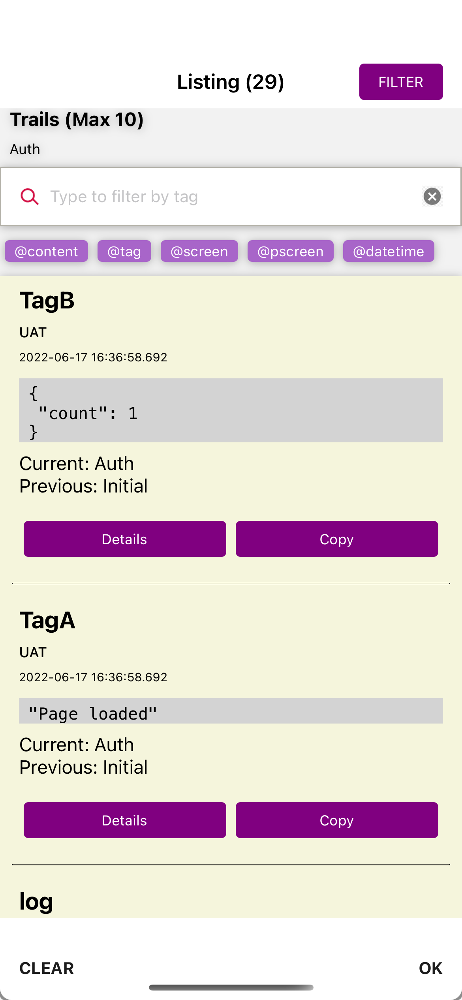

## Introduction

This package allow developer to insert a UI logger bar just below your main app. 

The logger will override console.log in the project, so that it will show up inside the UI logger.

## Sample logs

        console.log("Single");
        ----log (2022-06-17 15:45:35.022) [[ UAT - Auth ]] ----
        "Single"
        ----END Tag (2022-06-17 15:45:35.022) [[ UAT  - Auth ]] ----

        console.log("Tag", { happy: 1 });
        ----Tag (2022-06-17 15:45:35.022) [[ UAT - Auth ]] ----
        { 
            "happy" : 1
        }
        ----END Tag (2022-06-17 15:45:35.022) [[ UAT  - Auth ]] ----

        console.log("Tag2", "ABC")
        ----Tag2 (2022-06-17 15:45:35.022) [[ UAT - Auth ]] ----
        "ABC"
        ----END Tag2 (2022-06-17 15:45:35.022) [[ UAT  - Auth ]] ----

        console.log("Tag2", "ABC", "Nextline")
        ----Tag2 (2022-06-17 15:45:35.022) [[ UAT - Auth ]] ----
        "ABC"
        "Nextline"
        ----END Tag2 (2022-06-17 15:45:35.022) [[ UAT  - Auth ]] ----

## Configuration

        <UILoggerDebugger show={__DEV__} env={'UAT'} logConfig={{characterLimitPerArg: 100000 }} />

env: Setup yor ENV name here, will show up yor ENV in each log
logConfig: Set your console log character limit here, UI logger won't be affected. If not state, will default not to limit the log.
show: Setup to show the console bar in the project, __DEV__ settings is affected by the project itself.

## Tracking navigation in react-navigation package

To track navigation and show it in your project, you will have to do some setup inside your project, otherwise, it will show as undefined.

        <View style={{ flex: 1, flexDirection: "column"}}>
            <NavigationContainer
                ref={navigationRef}
                onReady={() => routeNameRef.current = navigationRef.current.getCurrentRoute().name }
                onStateChange={() => {
                    const previousRouteName = routeNameRef.current;
                    const currentRouteName = navigationRef.current.getCurrentRoute().name;
                    
                    // Setup your navigation tracking here...
                    Console.getInstance().previousScreen = previousRouteName;
                    Console.getInstance().currentScreen = currentRouteName;
                    Console.getInstance().addNavigations(currentRouteName);
                    ...
                }}>
                ...
            </NavigationContainer>
        </View>

## Tracking webview

On webview initialize, you could also add below code to track url:

        Console.getInstance().url = <your webview current url>;

    

